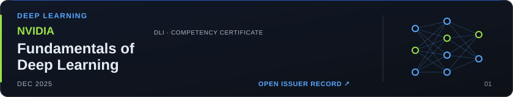
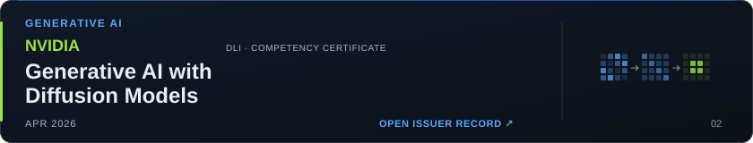
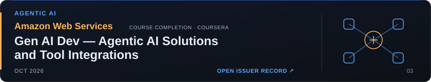
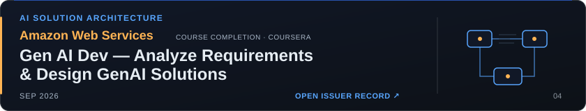
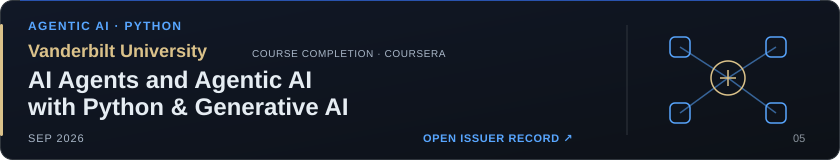

<!-- Komarev records requests through GitHub; the visible badge is a daily snapshot. -->

---

## About Me

I am **Melek Moalla**, an **AI engineering student at ESPRIT in Tunisia**, building projects in machine learning, deep learning, computer vision, reinforcement learning, and software engineering.

I build intelligent software systems that connect **machine learning**, **backend engineering**, and **product-facing interfaces** into one coherent experience.

- 🧠 **Applied ML & deep learning** — plant genomics, disease detection, explainable surrogate models
- 👁️ **Computer vision** — real-time hand tracking, gesture recognition and AR interaction
- ⚡ **Real-time systems** — WebSocket streaming, Redis, observability dashboards
- 🧩 **Full-stack AI products** — FastAPI / Django backends with React and Flutter frontends
- 📚 **RAG & NLP** — knowledge-grounded assistants and workflow automation
- 🎮 **Reinforcement learning** — PPO agents, reward design and honest evaluation of what agents actually learn
- 🤖 **Agent tooling** — orchestrating Claude Code and Codex CLI agents side by side

I care about systems that are technically credible *and* actually usable: clean APIs, interpretable ML, and interfaces that make complex outputs feel actionable.

---

## Featured Projects

  
  
  
  
  
  
  
  
  
  

### Project Highlights

| Project | What it does | Stack |
| --- | --- | --- |
| [Reward-Goblin](https://github.com/MoallaMelek/Reward-Goblin) | Reward hacking made visible: real PPO agents exploit misspecified reward functions, measured against a separate true objective across seeds and unseen layouts | Python, PyTorch, Stable-Baselines3, Gymnasium, Pymunk, FastAPI |
| [Hydra-Agent-Orchestrator](https://github.com/MoallaMelek/Hydra-Agent-Orchestrator) | Cross-platform desktop app that runs, monitors and coordinates Claude Code and OpenAI Codex CLI agents in parallel | TypeScript, Node.js, MCP |
| [Reinforcement-Learning-Memory-Dungeon](https://github.com/MoallaMelek/Reinforcement-Learning-Memory-Dungeon) | PPO lab comparing feed-forward, short-history and recurrent agents in partially observable dungeons, with memory-deletion experiments | Python, PyTorch, Streamlit |
| [Vector-CS](https://github.com/MoallaMelek/Vector-CS) | Controls the real Windows desktop with webcam hand gestures: grab, throw, snap and resize windows | Python, Computer Vision, Win32 API |
| [Deep-Learning-Plant-DNA-Optimization](https://github.com/MoallaMelek/Deep-Learning-Plant-DNA-Optimization) | Plant disease detection, crop DNA optimization, IoT agronomy analytics and genomic decision support | Python, Deep Learning, FastAPI, Flutter |
| [AI-Driven-Therapeutic-Protein-Plant-Synthesis](https://github.com/MoallaMelek/AI-Driven-Therapeutic-Protein-Plant-Synthesis) | Plant-host-aware protein DNA optimization with grouped surrogate modeling, explainability and decision dashboards | Python, Streamlit, scikit-learn, XGBoost, SHAP |
| [Real-Time-Payment-Observability-Dashboard](https://github.com/MoallaMelek/Real-Time-Payment-Observability-Dashboard) | Privacy-safe live payment monitoring with synthetic replay and guarded analytics | FastAPI, React, TypeScript, WebSockets, Redis |
| [Telekinesis-CV](https://github.com/MoallaMelek/Telekinesis-CV) | Hand-controlled AR playground with gesture recognition and custom physics | Python, OpenCV, MediaPipe |
| [Festy-Event](https://github.com/MoallaMelek/Festy-Event) | Event booking platform with QR tickets, venue maps, availability calendar, PDF invoices and admin analytics | Django, Leaflet, Chart.js, WeasyPrint |
| [LogiXpress-WebSite](https://github.com/MoallaMelek/LogiXpress-WebSite) | Logistics platform with delivery tracking, packaging workflows, notifications and AI-assisted modules | PHP, MySQL, Firebase, Python |

---

## Tech Stack

| Area | Tools |
| --- | --- |
| AI / ML | PyTorch, TensorFlow, scikit-learn, XGBoost, SHAP, pandas, NumPy |
| Reinforcement Learning | Stable-Baselines3 (PPO, A2C), Gymnasium, Pymunk |
| Computer Vision | OpenCV, MediaPipe |
| AI Product Patterns | RAG, NLP workflows, explainable ML, analytics dashboards |
| Backend | FastAPI, Django, REST APIs, WebSockets, Redis |
| Frontend & Mobile | React, TypeScript, JavaScript, Flutter |
| Data & Storage | PostgreSQL, MySQL, Firebase |
| Delivery | Git, GitHub Actions, Docker |

---

<!-- certifications:start -->
## Professional Learning & Certifications

Five completed courses across **deep learning**, **generative AI**, **agentic AI**, and **AI solution architecture**. The learning complements the engineering projects above; each credential links to its issuer record and original certificate.

<a href="https://learn.nvidia.com/certificates?id=nQezqvF2S3GIgeoy1hNHKw">
  <picture>
    <source media="(max-width: 600px)" srcset="assets/certifications/nvidia-deep-learning-mobile.svg" />
    
  </picture>
</a>

**NVIDIA · Fundamentals of Deep Learning**  
[Issuer record](https://learn.nvidia.com/certificates?id=nQezqvF2S3GIgeoy1hNHKw) · [Original certificate PDF](certificates/nvidia-deep-learning.pdf)

<a href="https://learn.nvidia.com/certificates?id=IkT2VY9-TWGR3EvSAaeFNA">
  <picture>
    <source media="(max-width: 600px)" srcset="assets/certifications/nvidia-diffusion-mobile.svg" />
    
  </picture>
</a>

**NVIDIA · Generative AI with Diffusion Models**  
[Issuer record](https://learn.nvidia.com/certificates?id=IkT2VY9-TWGR3EvSAaeFNA) · [Original certificate PDF](certificates/nvidia-diffusion.pdf)

<a href="https://coursera.org/verify/DQZ61608JYWW">
  <picture>
    <source media="(max-width: 600px)" srcset="assets/certifications/aws-agentic-mobile.svg" />
    
  </picture>
</a>

**Amazon Web Services · Gen AI Dev- Agentic AI Solutions and Tool Integrations**  
[Verify completion](https://coursera.org/verify/DQZ61608JYWW) · [Original certificate PDF](certificates/aws-agentic.pdf)

<a href="https://coursera.org/verify/KN4I9UGNT0WZ">
  <picture>
    <source media="(max-width: 600px)" srcset="assets/certifications/aws-genai-design-mobile.svg" />
    
  </picture>
</a>

**Amazon Web Services · Gen AI Dev- Analyze Requirements & Design GenAI Solutions**  
[Verify completion](https://coursera.org/verify/KN4I9UGNT0WZ) · [Original certificate PDF](certificates/aws-genai-design.pdf)

<a href="https://coursera.org/verify/3SRF1BKFHQ9M">
  <picture>
    <source media="(max-width: 600px)" srcset="assets/certifications/vanderbilt-agents-mobile.svg" />
    
  </picture>
</a>

**Vanderbilt University · AI Agents and Agentic AI with Python & Generative AI**  
[Verify completion](https://coursera.org/verify/3SRF1BKFHQ9M) · [Original certificate PDF](certificates/vanderbilt-agents.pdf)

NVIDIA awards are Certificates of Competency; AWS and Vanderbilt awards are Coursera course completions.

---
<!-- certifications:end -->

## GitHub Analytics

  
  

  

  

Stats, language and project cards, and the profile views badge are refreshed daily by a GitHub Action. The views badge keeps its last good value if the counter is unavailable.

---

## What I Am Building Next

- Currently improving [Reward Goblin](https://github.com/MoallaMelek/Reward-Goblin), my reinforcement-learning playground for exploring reward hacking with real PPO agents and separate task-success evaluation
- Smarter RAG-driven experiences with strong retrieval quality and practical UX
- AI-first full-stack applications where backend intelligence directly shapes the interface
- Real-time computer vision and streaming systems that run reliably outside the notebook
- NLP and HR Tech workflows that automate real business decisions
- Evaluation tooling that checks what AI agents actually do, not just the score they report

---

## Contact

